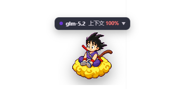
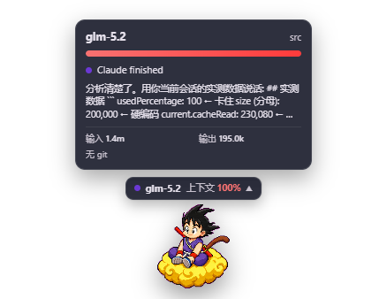
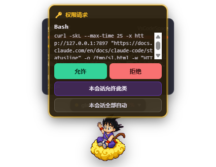
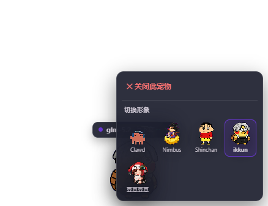
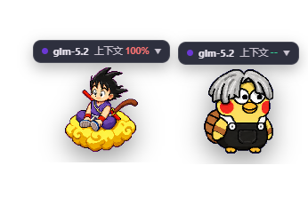

# 🐾 ClaudePet

**Claude Code 的桌面宠物** —— 一只常驻你桌面的小精灵，实时反映每个 Claude Code 会话的状态。

Rust + Tauri。单一二进制。一会话一宠物。

[](LICENSE)
[](#)
[](https://tauri.app)
[](https://www.rust-lang.org/)

> **中文** · ClaudePet 是 [Claude Code](https://claude.com/claude-code) 的桌面伴侣。它为每个 Claude Code 会话生成一个始终置顶的小宠物窗口，实时显示当前模型、上下文用量、token 统计、git 状态、工具活动与权限请求 —— 全部通过 Claude Code 的 statusLine + hooks 集成实时同步。打包为单一约 13 MB 二进制（GUI + CLI 合一），无额外运行时依赖。一条命令安装，开一个新的 Claude Code 会话即可。

---

## 目录

- [特性](#特性)
- [截图](#截图)
- [快速开始](#快速开始)
- [交互指南](#交互指南)
- [CLI 命令](#cli-命令)
- [故障排查](#故障排查)
- [自定义宠物](#自定义宠物)
- [架构](#架构)
- [开发](#开发)
- [常见问题](#常见问题)
- [贡献](#贡献)
- [致谢](#致谢)
- [License](#license)

---

## 特性

- 🐾 **每会话一只宠物** — 每个 Claude Code 会话独立窗口、独立状态、独立形象
- 📊 **实时状态显示** — 模型名称、上下文用量（HP 条）、当前工具状态、token 输入/输出、git 分支
- 🎭 **丰富的状态动画** — idle / thinking / running-tool / waiting / success / error / run / compact 等，跟随 Claude 的每一步
- 🖱️ **右键切换形象** — 按会话独立，每个窗口可挂不同宠物
- 🔌 **一键集成 Claude Code** — `install` 自动写入 statusLine + 15 个 hooks，无需手动配置
- 🚀 **点击穿透** — 透明区域点击直穿桌面，移到宠物实体上才可交互
- 🔑 **权限确认弹窗** — Claude Code 请求工具调用权限时弹出卡片，支持 允许 / 拒绝 / 本会话允许此类 / 本会话全部自动
- 📦 **单一二进制** — GUI 主进程与 CLI（statusline / hook / install / doctor）共用一个 exe，无额外运行时依赖（~13 MB）
- 🪟 **跨平台** — Windows / macOS / Linux

---

## 截图

### 桌面常驻宠物

精灵 + 状态条 + HP 条常驻桌面，始终置顶；透明区域点击穿透，只有精灵实体可交互。



### 信息面板

左键状态条展开信息面板：模型名称、当前 cwd、实时 token（输入 / 输出 / 上下文用量）、git 分支与状态。



### 权限确认弹窗

Claude Code 请求工具调用权限时，宠物上方弹出橙色卡片，支持 允许 / 拒绝 / 本会话允许此类 / 本会话全部自动。



### 右键切换形象

右键宠物打开上下文菜单，按会话独立切换内置宠物形象，或关闭当前宠物。



### 多会话多宠物

每个 Claude Code 会话独立窗口、独立状态、独立形象，同屏多宠共存。



---

## 快速开始

### 方式一：下载发布包（推荐）

到 [Releases](../../releases) 下载对应平台安装包或便携版：

- **Windows**：`ClaudePet_<version>_x64-setup.exe`（NSIS 安装包，内置宠物资源）或便携版 zip（解压即用）
- **macOS / Linux**：从源码构建（见下）

### 方式二：从源码构建

```bash
git clone https://github.com/iethancode/claude-pet.git
cd claude-pet
pnpm install
pnpm tauri build      # 产物在 src-tauri/target/release/
```

> 构建需要 [Rust](https://rustup.rs/)（stable）+ [Node.js](https://nodejs.org/) 18+ / [pnpm](https://pnpm.io/)，以及 [Tauri v2 系统依赖](https://tauri.app/start/prerequisites/)。

### 三步上手

**1. 启动桌宠**

双击 `claude-pet.exe`（或安装后从开始菜单启动）。系统托盘出现 ClaudePet 图标。此时还没有宠物窗口——因为还没有 Claude Code 会话。

**2. 集成到 Claude Code**

右键托盘的 ClaudePet 图标 → **「集成到 Claude Code(全局)」**。

这会把 `claude-pet statusline` 和 `claude-pet hook` 写进 `~/.claude/settings.json`。原文件自动备份为 `settings.json.claudepet-backup-<时间戳>`。

**3. 开一个新的 Claude Code 会话**

在任意目录运行 `claude`。Claude Code 触发 statusLine / hook 事件 → 宠物窗口自动出现并实时跟随状态。

> 只有**集成之后新开**的会话才会触发桌宠，已在运行的会话不受影响。

---

## 交互指南

| 操作 | 行为 |
|---|---|
| **左键状态条** | 展开 / 收起信息面板 |
| **右键宠物** | 上下文菜单（切换形象 / 关闭此宠物） |
| **拖动宠物** | 拖动整个窗口 |
| **托盘左键** | 显示所有桌宠窗口 |
| **托盘右键菜单** | 显示/隐藏所有宠物、集成/移除全局集成、退出 |

宠物窗口始终置顶。透明区域点击穿透到桌面，只有精灵实体区域可交互。

### 权限确认弹窗

Claude Code 执行需要确认的操作（运行命令、写文件等）时，宠物上方弹出橙色卡片：

| 按钮 | 行为 |
|---|---|
| **允许** | 本次允许，后续同类仍会询问 |
| **拒绝** | 本次拒绝，Claude Code 跳过该工具 |
| **本会话允许此类** | 允许本次 + 通过 `updatedPermissions` 记住，本会话不再询问这类操作 |
| **本会话全部自动** | 允许本次 + 本会话所有后续工具自动允许，不再弹窗 |

> 当操作的 `permission_suggestions` 为空时（如任意 bash 命令），「本会话允许此类」按钮不显示。选择「本会话全部自动」后，该会话后续权限请求由常驻主进程自动放行，跨 hook 进程生效。

---

## CLI 命令

`claude-pet` 二进制同时也是 CLI（集成后由 Claude Code 自动调用，通常无需手动执行）：

```bash
claude-pet                          # 无子命令 → 启动 GUI
claude-pet statusline               # 读 stdin statusLine JSON → 转发事件 → 输出回退行
claude-pet hook                     # 读 stdin hook 事件 → 转发事件
claude-pet install --scope user     # 写入 ~/.claude/settings.json：statusLine + 15 hooks
claude-pet uninstall --scope user   # 移除集成
claude-pet start                    # 后台启动 GUI 主进程
claude-pet pets                     # 列出可用宠物
claude-pet doctor                   # 诊断集成健康度（排障首选）
```

### install / uninstall

```bash
# 全局集成（推荐，所有项目生效）
claude-pet install --scope user --preserve-statusline

# 仅当前项目集成
claude-pet install --scope local

# 卸载
claude-pet uninstall --scope user
```

- `--preserve-statusline`：保留原有 statusLine（若有），纳入 ClaudePet 转发机制
- `install` 不替换已有 hooks，只在每个事件数组追加 `claude-pet hook`（若不存在）
- 安装前自动备份 `settings.json`，卸载时恢复

### doctor 诊断

```bash
claude-pet doctor
```

检查项：路径、bridge 是否运行且可达、宠物资源、`settings.json` 合法性、statusLine 与 15 个 hooks 是否就位。输出示例：

```
== paths ==
claude-pet home: C:\Users\you\.claudepet
Claude home:     C:\Users\you\.claude
pet dir:         ...\claude-pet\pet

== runtime ==
  bridge: running (pid 34356, port 64297)
  bridge: reachable (/state responded)

== Claude Code integration ==
  statusLine: integrated ✓
  hooks: 15/15 events integrated

== result ==
all good ✓
```

---

## 故障排查

| 现象 | 检查 |
|---|---|
| **桌宠不出现** | `claude-pet doctor` 看 bridge 是否 running、集成是否就位；未集成则托盘「集成到 Claude Code」 |
| **集成后宠物还不出现** | 确认是**新开**的 Claude Code 会话（已有会话不生效），或等 2 秒等首次 statusline/hook 触发 |
| **状态长时间停在 idle** | hook 没装齐，`doctor` 看 hooks 是否 15/15，少则重装 |
| **移动 exe 后失效** | 路径写死在 `settings.json`，搬动后必须重新 `install` |
| **多个会话宠物数对不上** | 同 cwd 的会话 5 分钟内会共用一只宠物（`/clear` 接管），要分开就在不同目录跑 |
| **关了终端宠物还在** | 等 15 分钟自动回收，或右键 → 关闭此宠物 |
| **state.json 损坏** | 自动隔离为 `state.json.corrupt-<时间戳>`，下次事件到达时重建 |
| **settings.json 被改坏** | install 严格模式，损坏时报错退出不覆盖；手动修复或从备份还原后重试 |
| **权限弹窗不出现** | 检查 `settings.json` 的 `PermissionRequest` hook 是否存在，timeout 应为 300 |
| **双击 exe「localhost 拒绝连接」** | exe 是直接 `cargo build` 编的，没启用 `custom-protocol` feature。必须用 `pnpm tauri build`，或 `cargo build --release --features custom-protocol`（见[开发](#开发)） |
| **IDE 扩展里宠物不显示模型/token** | IDE 以 `--no-chrome` headless 模式启动，不触发 statusLine；ClaudePet 已改为从 hook + transcript 补齐这些字段，但仍可能不如终端模式完整 |

---

## 自定义宠物

`pet/<id>/` 目录下放 `pet.json`（manifest）+ `spritesheet.webp`（精灵图）：

| 字段 | 说明 | 默认值 |
|---|---|---|
| `id` | 宠物唯一标识（文件夹名需一致） | 必填 |
| `displayName` | 显示名称 | 必填 |
| `frameWidth` | 单帧宽度（px） | 192 |
| `frameHeight` | 单帧高度（px） | 208 |
| `columns` | 精灵图列数 | 8 |
| `rows` | 精灵图行数 | 9 |
| `defaultScale` | 缩略图缩放 | 0.48 |

动画映射在 `pet.json` 的 `anims` 字段，支持 `idle`、`thinking`、`tool`、`waiting`、`success`、`error`、`run` 七种。

### 内置宠物

| ID | 名称 | 说明 |
|---|---|---|
| `clawd` | Clawd | 官方 Claude Code 像素风，紧凑体型 |
| `ikkun` | ikkun | 灰色刘海、圆眼红腮团雀风 |
| `nimbus` | Nimbus | 迷你功夫小子，跨金色祥云 |
| `shinchan` | Shinchan | 蜡笔小新 |
| `doudoudoudou` | 豆豆豆豆 | 兔耳帽兜桌宠 |

### 下载 / 分享更多宠物

- 下载：到 [Codex Pets](https://codex-pets.net/) 或社区找宠物 ZIP，解压到 ClaudePet 的 `pet/` 目录，重启即可在右键菜单看到。
- 分享：打包你的 `pet/<id>/` 文件夹（含 `pet.json` + `spritesheet.webp`）即可。

---

## 桌宠展示什么

- **会话信息** — session ID、cwd、模型、Claude Code 版本
- **上下文容量** — 使用百分比、HP 条、实时 token
- **token 统计** — 实时输入/输出（来自 transcript，k/m 缩写显示）
- **git 状态** — 分支、dirty/ahead/behind
- **任务状态** — idle、thinking、running-tool、waiting-permission、subagent-running、task-created/completed、completed、error、compacting/compacted
- **权限请求** — 需要确认的工具调用，直接在宠物上应答

需要「注意」的状态（权限请求等）会高亮状态点并触发系统通知。

---

## 多会话与生命周期

- **一会话一宠物**：每个 `session_id` 独立窗口，状态/形象/位置/面板互不影响。
- **`/clear` 不多出宠物**：新 session 的事件到达时，若 cwd 与 5 分钟内活跃的旧 session 相同，整体接管其窗口/状态，而非另开。
- **自动收尾**：收到 `SessionEnd` 立即销毁；超过 15 分钟无事件的 session 由后台任务（每分钟扫一次）清理；启动时不复活历史宠物。
- **并发写入安全**：所有 `~/.claudepet/*.json` 走「临时文件 + 原子 rename」；损坏文件自动隔离。

---

## 架构

```
Claude Code ──statusLine/hook (stdin JSON)──▶ claude-pet statusline|hook   (短命 CLI 进程)
                                                     │
                                       读 ~/.claudepet/runtime.json {port,token}
                                                     │ HTTP POST /event (Bearer)
                                                     ▼
                             claude-pet (GUI 主进程, 常驻, Tauri + axum)
                                 ├─ axum 桥接服务器 (4 端点, 独立 tokio runtime 线程)
                                 ├─ state.json 会话状态持久化
                                 ├─ 每会话一个 WebviewWindow (label = session_id)
                                 └─ emit("claudepet:update") ──▶ React 渲染层
```

**单一二进制**：`main.rs` 用 clap 解析子命令，有子命令走 CLI，无子命令启动 Tauri GUI。`start` 子命令 spawn 自身（无参数）。

**桥接服务器**（`bridge/`）：`start_bridge` 在独立 `std::thread` + 自有 `tokio::runtime` 跑 axum。**必须用独立 runtime**——Tauri 的 async_runtime 不保证为 spawned task 装配 I/O driver，会导致 `accept()` 永不唤醒（实测卡死）。4 个端点：`GET /state`、`POST /event`、`POST /permission-request`、`POST /permission-clear`，Bearer token 鉴权。权限请求用 `tokio::sync::oneshot` + 295s 超时阻塞等用户决定。

**IDE 模式数据来源**：Claude Code 在 IDE 扩展以 `--no-chrome` headless 模式启动，**不触发 statusLine**，导致 model / cwd / 上下文% / token 全部拿不到（只有 15 个 hook 照常触发）。为此 `hook` 子命令在每次事件时从 hook payload（`session_id`、`cwd`、`transcript_path`）+ transcript 解析补齐（`state::status::build_session_meta_from_hook`），与 `status` 一起 merge 进会话状态。终端模式下 statusLine 正常触发，两种来源 merge 不冲突。

> transcript token 解析：`cache_read_input_tokens` 是「当前上下文从缓存重读的大小」，**不能跨记录累加**（每次 API 调用都重读整个历史，累加会得到千万级虚数），只取最后一条 assistant 记录的值；`input` / `output` / `cache_creation` 才累加为真实消耗。

### 目录结构

```
claude-pet/
├── src/                      # React 渲染层 (TS + Vite + Tailwind)
│   ├── views/PetView.tsx     #   宠物窗口：状态条 + 面板 + 右键菜单 + 权限卡片
│   ├── components/PetCanvas.tsx  # 精灵图 canvas 切帧
│   ├── hooks/useUpdate.ts    #   监听 claudepet:update 事件
│   └── lib/                  #   invoke / types / format / animation
├── src-tauri/src/
│   ├── main.rs               # 入口：clap 分派 GUI / CLI
│   ├── lib.rs                # Tauri Builder + invoke_handler
│   ├── bridge/               # axum 桥接服务器 + 权限 oneshot + auto-yes
│   ├── cli/                  # statusline / hook / install / doctor / pets
│   ├── domain/               # config / cursor / paths / pets / transcript / git
│   ├── state/                # runtime_state (state.json) + status 构建
│   ├── passthrough.rs        # 点击穿透轮询管理器
│   ├── commands.rs           # 暴露给渲染层的 Tauri 命令
│   └── tray.rs               # 系统托盘
├── pet/                      # 宠物资源（5 个内置，每个含 pet.json + spritesheet.webp）
└── screenshots/              # 截图（pet-idle / pet-panel / pet-permission / pet-menu / multi-session）
```

### 数据目录

| 路径 | 内容 |
|---|---|
| `~/.claudepet/config.json` | 用户配置（selectedPet、selectedPets、窗口位置等） |
| `~/.claudepet/runtime.json` | GUI 运行时信息（port/token/pid），CLI 据此发现 bridge |
| `~/.claudepet/state.json` | 会话状态持久化（每个 session 的 status、pendingPermission、token 等） |
| `~/.claude/settings.json` | Claude Code 配置（install 写入的集成信息） |

可用环境变量 `CLAUDEPET_HOME`、`CLAUDE_HOME` 自定义路径。

---

## 开发

### 前置

- [Rust](https://rustup.rs/)（stable）
- [Node.js](https://nodejs.org/) 18+ 与 [pnpm](https://pnpm.io/)
- [Tauri v2 系统依赖](https://tauri.app/start/prerequisites/)

### 开发模式

```bash
pnpm install
pnpm tauri dev
```

启动 Vite dev server + 编译运行 Tauri GUI。改 Rust 自动重编译，改前端 Vite HMR。

### 生产构建

```bash
pnpm tauri build
```

产物在 `src-tauri/target/release/`：

- `claude-pet.exe` — ~13 MB 单二进制
- `bundle/nsis/ClaudePet_<version>_x64-setup.exe` — NSIS 安装包（内置 pet 资源）

### ⚠️ 切勿直接 cargo build

Tauri 2 用 `custom-protocol` feature 决定宠物窗口运行时加载什么：

- **启用** → 窗口走内嵌资源 `tauri://localhost`，dist 打进二进制 ✅
- **未启用** → 窗口回退到 `devUrl = http://localhost:65173`（Vite dev server），没起 → **「localhost 拒绝连接」** ❌

`Cargo.toml` 里 `custom-protocol` 没放进 `default`：

```toml
[features]
custom-protocol = ["tauri/custom-protocol"]
```

`pnpm tauri dev` / `pnpm tauri build` 会自动加该 feature；**直接 `cargo build` 不会**。若必须绕过 Tauri CLI（IDE 调试等），手动加 feature 且 dist 要先 build 好：

```bash
pnpm build                                  # 先生成 dist/
cargo build --release --features custom-protocol
```

自查 exe 是否编对（应能 grep 到 dist 资源名）：

```bash
grep -c "index-.*\.js" target/release/claude-pet.exe   # 正确：≥1；错误：0
```

### 类型检查

```bash
node node_modules/typescript/bin/tsc --noEmit
cargo check
```

### 关键设计决策

- **独立 tokio runtime**：Tauri async_runtime 无 I/O driver，bridge 必须用独立 runtime 线程跑 axum，否则 `accept()` 卡死。
- **camelCase 对齐**：Rust `PetManifest` 用 `rename_all = "camelCase"`，与 `pet.json` 及前端 TS 一致，否则前端读到 `frame_width = undefined` → canvas 尺寸 0。
- **asset protocol 路径**：Windows 绝对路径反斜杠在 `convertFileSrc` 前转正斜杠。
- **点击穿透**：用 cursor-position 轮询 + 命中矩形（Electron 的 `{forward:true}` 在 Tauri 不可用），命中矩形外穿透、内可交互，菜单/拖拽期间 hold。
- **权限 hook 输出格式**：必须用 `hookSpecificOutput.decision.{behavior,updatedPermissions}` 规范格式，Claude Code 才读得懂。
- **install 严格模式**：读损坏 `settings.json` 时报错退出、保留原文件，而非静默吞配置。

---

## 常见问题

<details>
<summary><b>支持哪些 Claude Code 客户端？</b></summary>

CLI（`claude` 命令）、Desktop、IDE 扩展（VS Code / Trae 等）均可。终端 CLI 模式体验最完整（statusLine + hooks 全触发）；IDE 模式下 statusLine 不触发，ClaudePet 会从 hook + transcript 补齐模型/token/上下文等数据。
</details>

<details>
<summary><b>权限请求 / AskUserQuestion 能在宠物上应答吗？</b></summary>

- **终端模式 + MCP elicitation**：支持（通过 `PermissionRequest` hook）。
- **IDE 模式 + AskUserQuestion**：不支持——IDE 以 `--no-chrome` + `--permission-prompt-tool stdio` 启动，权限与用户输入走 IDE 原生 UI，不触发 hook，宠物无法接管。
</details>

<details>
<summary><b>宠物资源版权归谁？</b></summary>

内置宠物精灵素材来自 [Codex Pets](https://codex-pets.net/) 等社区，版权归原作者。本项目代码以 MIT 协议开源，宠物素材的再分发请遵循其原始授权。
</details>

<details>
<summary><b>占用资源大吗？</b></summary>

单个 exe ~13 MB，常驻 GUI 主进程内存约 15 MB；每个会话宠物窗口额外约几 MB。hook / statusline 是短命 CLI 进程，事件触发即起即退。
</details>

---

## 贡献

欢迎 Issue 和 PR！

- 🐛 发现 bug → 提 [Issue](../../issues)，附 `claude-pet doctor` 输出
- 🎨 新宠物 → 打包 `pet/<id>/`（`pet.json` + `spritesheet.webp`）提 PR
- 🌐 翻译 / 文档完善 → 直接 PR
- 💡 新功能建议 → 先开 Issue 讨论

开发前请阅读[开发](#开发)章节，注意 `pnpm tauri build` 而非 `cargo build`。

---

## 致谢

- [Claude Code](https://claude.com/claude-code) — statusLine / hooks 体系是 ClaudePet 存在的前提
- [Codex Pets](https://codex-pets.net/) — 宠物精灵素材
- [Tauri](https://tauri.app/) — 跨平台桌面应用框架
- [linux.do](https://linux.do/) 社区 — 反馈与讨论

---

## License

[MIT](LICENSE) © 2026 iethancode
